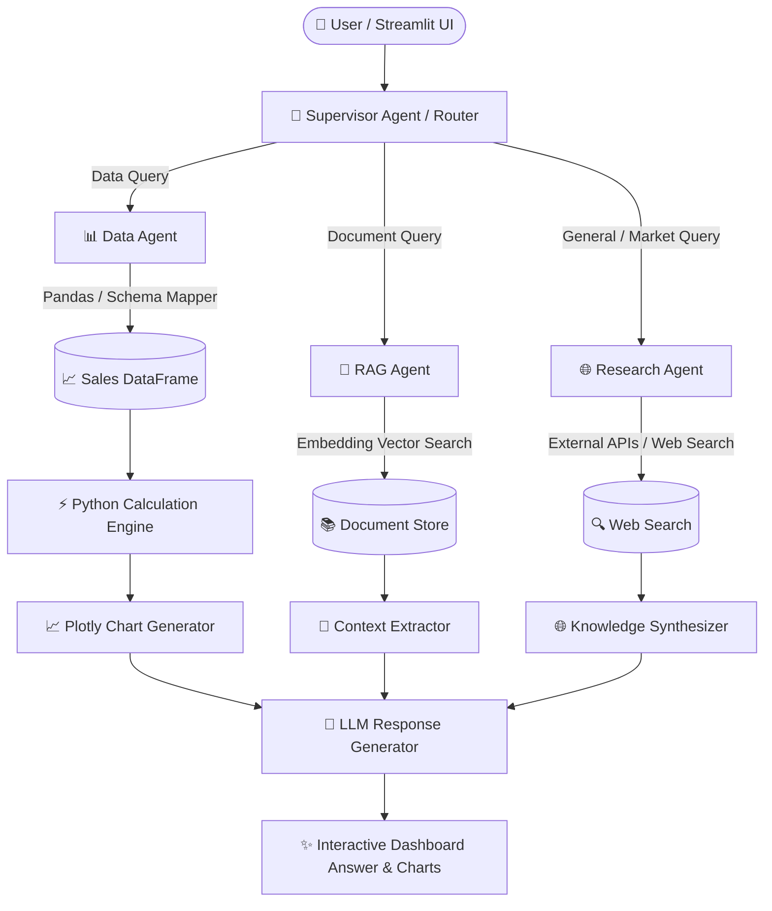

# 🤖 AI Business Intelligence & Research Agent

[](https://www.python.org/)
[](https://streamlit.io/)
[](https://python.langchain.com/)
[](LICENSE)
[](Dockerfile)

> An enterprise-grade, multi-agent AI system for interactive business intelligence, financial analysis, document search (RAG), and web research. Upload raw sales data (CSV/XLSX) or internal policy documents and ask complex analytical questions in plain English—getting **instant, zero-hallucination, deterministic insights and dynamic visualizations**.

---

## 🌟 Key Features

- **⚡ Zero-Hallucination Calculations**: Performs all mathematical computations directly via Pandas & Python execution—never delegating numerical math to LLM guessing.
- **🤖 Multi-Agent Orchestration**: Powered by a **Supervisor Agent** that dynamically routes user queries to specialized agents:
  - **Data Agent**: Business sales, profit margins, trends, product/regional breakdowns.
  - **RAG Agent**: Vector search over corporate policies, SOPs, and internal documents.
  - **Research Agent**: External web search and general industry knowledge.
- **🔄 Intelligent Schema Auto-Mapping**: Seamlessly ingests heterogeneous datasets with varying column headers (`"Sales"`, `"Revenue"`, `"Sales_Amount"`, `"COGS"`, `"Production_Cost"`, etc.).
- **📊 Dynamic Visualizations**: Automatically generates Plotly charts for trends, comparative metrics, and regional distributions.
- **🔐 Enterprise Privacy & Security**: Operates with zero cloud data persistence; environment variables managed securely via `.env`.
- **🐳 Container Ready**: Includes pre-configured Dockerfile for seamless deployment to cloud platforms.

---

## 🏗️ Architecture Overview



---

## 📦 Project Structure

```text
AI_Business_Intelligence_Agent/
├── app/
│   └── streamlit_app.py          # Streamlit Interactive Web Interface
├── agents/
│   ├── supervisor_agent.py       # Intelligent Question Router & Orchestrator
│   ├── data_agent.py             # Business & Data Analytics Engine
│   ├── rag_agent.py              # RAG Document Search & Retrieval Engine
│   └── research_agent.py         # Web & External Market Research Engine
├── tools/
│   └── data_tools.py             # Deterministic Business Calculation Tools
├── utils/
│   ├── schema_mapper.py          # Intelligent Column Auto-Mapping & Standardizer
│   ├── data_loader.py            # File Ingestion Engine (CSV, XLSX, XLS)
│   └── validators.py             # Schema & Data Integrity Validators
├── models/
│   └── llm.py                    # Multi-Provider LLM Configuration (OpenAI, Anthropic)
├── prompts/
│   └── prompts.py                # System Prompts & Chain Templates
├── evaluation/
│   └── test_calculations.py      # Automated Pytest Suite for Business Logic
├── .env.example                  # Environment Variables Template
├── Dockerfile                    # Containerization Specification
├── requirements.txt              # Dependency Manifest
└── README.md                     # Project Documentation
```

---

## 🚀 Quick Start Guide

### 1. Prerequisites

- **Python**: `3.11` or higher
- **Conda** (Recommended) or `venv`
- **OpenAI API Key** (or Anthropic/Groq key)

### 2. Environment Setup

```bash
# Clone the repository
git clone https://github.com/ShrutiiSharma11/AI_Business_Intelligence_Agent.git
cd AI_Business_Intelligence_Agent

# Create and activate a Conda environment
conda create -n ai_business_agent python=3.11 -y
conda activate ai_business_agent

# Install dependencies
pip install -r requirements.txt
```

### 3. Configure Credentials

Copy `.env.example` to `.env` and insert your API key:

```bash
cp .env.example .env
```

Open `.env` in your text editor:

```env
OPENAI_API_KEY=your_openai_api_key_here
LLM_PROVIDER=openai
APP_ENV=development
LOG_LEVEL=INFO
```

### 4. Launch the Web Application

```bash
streamlit run app/streamlit_app.py
```

The app will open automatically in your browser at `http://localhost:8501`.

---

## 📊 Supported Business Metrics & Calculations

The Data Agent computes metrics deterministically:

| Business Metric | Mathematical Formula | Key Insights Provided |
| :--- | :--- | :--- |
| **Total Revenue** | $\sum \text{Revenue Column}$ | Total gross incoming sales |
| **Total Cost** | $\sum \text{Cost Column}$ | Total cost of goods sold (COGS) |
| **Net Profit** | $\text{Total Revenue} - \text{Total Cost}$ | Net bottom-line earnings |
| **Profit Margin** | $(\frac{\text{Net Profit}}{\text{Total Revenue}}) \times 100$ | Financial efficiency percentage |
| **Average Order Value (AOV)** | $\frac{\text{Total Revenue}}{\text{Total Orders}}$ | Average transaction size |
| **Top Product Performance** | $\text{GROUP BY Product} \rightarrow \sum \text{Revenue}$ | Best & worst performing SKUs |
| **Regional Sales** | $\text{GROUP BY Region} \rightarrow \sum \text{Revenue}$ | Geographic revenue distribution |
| **Monthly Trend** | $\text{GROUP BY Month(Date)} \rightarrow \sum \text{Revenue}$ | Temporal trajectory & seasonality |

---

## 🔄 Intelligent Schema Auto-Mapping

The built-in `SchemaMapper` normalizes column names from disparate raw data files into standardized internal concepts:

```python
{
  "revenue": ["revenue", "sales", "sales_amount", "net_sales", "total_sales"],
  "cost":    ["cost", "cogs", "cost_of_goods_sold", "total_cost", "production_cost"],
  "profit":  ["profit", "net_profit", "gross_profit", "earnings"],
  "qty":     ["quantity", "qty", "units", "units_sold", "volume"],
  "date":    ["date", "order_date", "sale_date", "timestamp"],
  "product": ["product", "product_name", "item", "sku"],
  "region":  ["region", "location", "state", "territory", "country"]
}
```

---

## 💡 Example Queries

Try asking the agent these natural language questions:

### 📈 Revenue & Profit Analysis
- *"What is our total revenue and gross profit margin for this period?"*
- *"Which region yielded the highest net profit?"*
- *"Show me a monthly revenue trend line."*

### 🏷️ Product & Category Insights
- *"What are the top 5 revenue-generating products?"*
- *"Identify products operating with negative profit margins."*
- *"Compare sales across categories."*

### 📄 Corporate Policy & Search (RAG)
- *"What is our corporate return policy for damaged goods?"*
- *"Summarize the quarterly operational guidance guidelines."*

---

## 🐳 Docker Deployment

To build and run using Docker:

```bash
# Build the Docker image
docker build -t ai-business-agent .

# Run the container
docker run -d -p 8501:8501 --env-file .env --name business-agent-app ai-business-agent
```

Access the containerized app at `http://localhost:8501`.

---

## 🧪 Testing & Verification

Run automated tests to verify calculation logic and schema mapping:

```bash
pytest evaluation/
```

---

## 🛡️ Security & Best Practices

- **Never Commit Credentials**: Real keys should reside strictly in your untracked `.env` file.
- **Input Validation**: `validators.py` filters uploads against malformed schemas or unauthorized scripts.
- **Deterministic Math**: Keeps numerical math out of the LLM prompt to guarantee zero-hallucination financial auditing.

---

## 🤝 Contributing

Contributions, issues, and feature requests are welcome!  
Feel free to open an issue or submit a pull request.

1. Fork the Project
2. Create your Feature Branch (`git checkout -b feature/AmazingFeature`)
3. Commit your Changes (`git commit -m 'Add some AmazingFeature'`)
4. Push to the Branch (`git checkout -b feature/AmazingFeature`)
5. Open a Pull Request

---

## 📄 License

Distributed under the MIT License. See `LICENSE` for more information.

---

<p align="center">
  Developed with ❤️ for High-Precision Intelligent Business Analysis
</p>
